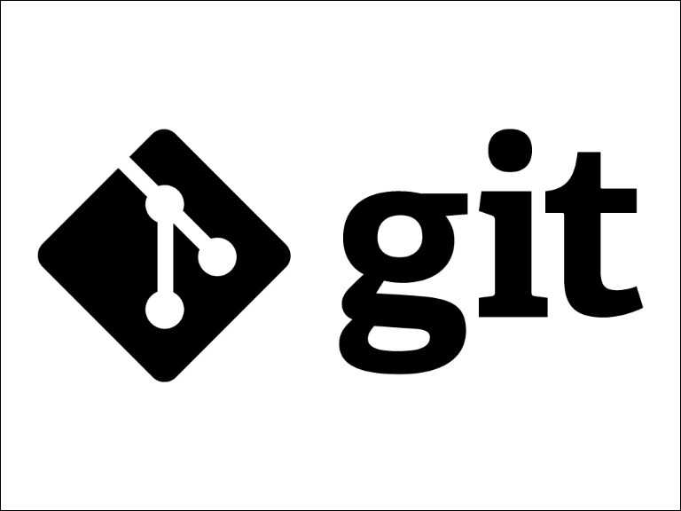

# Инструкция по Git

## Базовые команды

* git init
* git commit -m
* git status
* git branch 
* git branch branch_name
* git branch -d branch_name 
* git checkout checkout_name 
* git merge 
* git log
* git log --graph
* git add изменению
* git commit -am 

### Консольные команды

>: git branch - проверить на какой ветки находишься

>: git branch branch_name - создать новую ветку

>: git branch -**d** branch_name - удалить ветку

>: git checkout checkout_name - перейти на другую ветку

>: git merge - произвести слияние веток

>: git log - проверить сколько созданно commit

>: git log--graph - увидеть log commit с визуализацией

>: git add - добавить файл к следующему изменению

>: git commit -**am** создать **commit** сразу если раннее уже были созданны файлы не *ветки*, можно не использовать **add**

>: Все команды можно посмотреть по ссылке

<https://skillbox.ru/media/code/yazyk-razmetki-markdown-shpargalka-po-sintaksisu-s-primerami/?ysclid=lly72gf7h7592799650#stk-11>

## Для работы с изображениями необходимо добавить в файл .gitignore, а в файле с язиком разметки Markdown вписать следующую конструкцию:

## Чтобы решить конфликт, необходимо профиксить конфликт, выбрать одно из действий указанные в самом конфликте.

## Решение конфликта

### Выбираем пункт в списке конфликта, который вам нужен, фиксим конфликт и делаем коммит.

